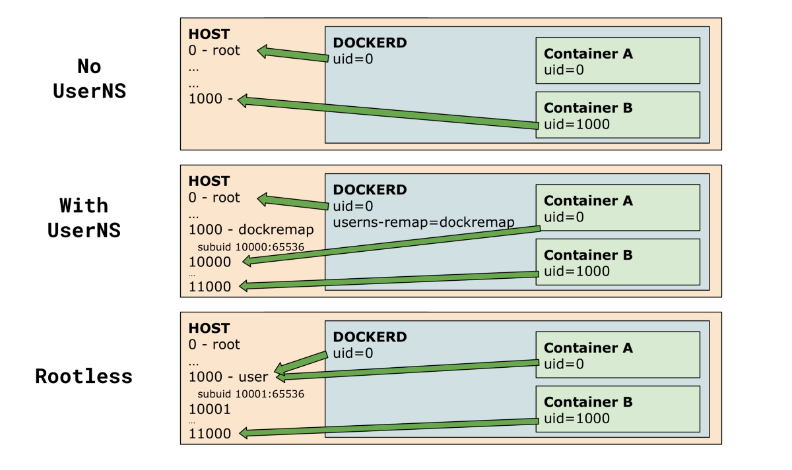

Docker motoru, genellikle Linux çekirdeğinin özelliklerine sıkıca entegre olmuş olan birçok harika özellik sunar. Örneğin, bir konteyner yalıtım özelliği, Linux namespacelerine dayanır. Linux'ta namespaceler oluşturmak için ayrıcalıklı yetkilere ihtiyacınız vardır. Docker’ın depolama modelinin temeli olan dosya sistemlerini bağlamak için de aynı şey geçerlidir. Bu nedenle Docker daemon'unun her zaman kök kullanıcı tarafından başlatılması gerekiyordu.

Moby ve BuildKit geliştiricisi Akhiro Suda tarafından yapılan harika bir çalışma. 2018'de BuildKit imaj oluşturucusuna köksüz destek özelliği eklendi ve Şubat 2019'dan itibaren de Moby ile de birleştirildi. Köksüz kullanım tüm Docker kullanıcıcılarının deneysel modda deneyebilmesi için şuan kullanıma açıktır.

### Kullanımı

Köksüz Docker ile çalışmaya başlanmasını kolaylaştırmak için bir script hazırlanmış;

`curl -sSL https://get.docker.com/rootless | sh`

Bu komut dosyasının yetkili bir kullanıcı ile çalıştırılması gerekmektedir. En son Docker CE kurulumunu indirecek, ana dizininizin altına çıkartacak ve sizin için arka planda başlatacak. Sisteminizin köksüz konteynerler çalıştırmaya hazır olup olmadığını ve yükleyicinin tamamanalabilmesi için bazı bağımlılıkların gerekli olması durumunda bazı kurulum komutlarını yazıp çalıştırabilir.

Ben Ubuntu 18.04, CentOS 7 ve Ubuntu 16.04 sürümlerinde test ettim. Manuel yükleme adımları için [buraya] bakabilirsiniz.

### Uyarı

Şu anda Köksüz Docker Modunu normal Docker motoru için bir yedek olarak düşünmeyin. Köksüz modda, Docker içerisinde kullanmak istediğiniz ama çalışmayan bazı şeyler bulunmaktadır. Bunlar;

- cgroups
- genel güvenlik profilleri
- overlay network
- kontrol noktası / geri yükleme

gibi gibi.

Portlar ile bağlantıları ayarlamak için, `socat` oldukça işe yarıyor.

Ubuntu dağıtımları, köksüz modda `overlay` dosya paylaşımına izin vermektedir. Centos'da ise dosya paylaşımı için `vfs` kullanılması gerekiyor.

Köksüz modun şu anda sadece test edilmesi için açık olduğunu bilmemiz gerekmektedir. Stabil bir sürümü yayınlanmadı.

### Nasıl Çalışır

Daha önce de belirttiğim gibi, Docker'ın ihtiyaç duyduğu birçok Linux özelliği ayrıcalıklı yetkiler gerektiriyor. Peki, köksüz mod durumda nasıl çalışıyor? 
Bunun cevabı namespaceler. Namespaceler, bir kullanıcı ID aralığını eşleştirir, böylece iç namespacedeki root kullanıcısı üst namespacedeki yetkili olmayan bir aralıkla eşlenir. Namespace alanındaki yeni process, aynı zamanda yukarıdan bir process kümesi de seçer.

Namespace özelliği Docker'dan uzun süredir konteynerlerin içindeki kullanıcıları ana bilgisayarda farklı bir aralıkta eşleştirir. `--userns-remap` bayrağı kullanılarak daha güvenli hale getirilir.

Linux, genişletilmiş yetkilere sahip olmayan kullanıcı namespacleri oluşturulmasına izin vermesine rağmen, bu namespaceler yalnızca bir kullanıcıyı eşler ve bu nedenle mevcutta bulunan konteynerler ile çalışmaz. Bunun üstesinden gelmek için, köksüz modun kullanıcıları bizim için yeniden yapılanmasını sağlayan `uidmap` paketi gereklidir. `uidmap` paketindeki ikili dosyalar setuid bit kullanır ve bu nedenle her zaman root olarak çalıştırılır.

Akihiro, Farklı namespacelerin başlatılması ve `uidmap` ile birlşetirilmesi için [rootlesskit] projesi oluşturulmuştur. Rootlesskit ayrıca rootless konteynerler için networking kurulumunuda yapmaktadır. Varsayılan olarak rootless docker, Docker Desktop ürünlerinde ağ oluşturmak için de kullanılan [moby/vpnkit] projesine dayalı ağ iletişimi kullanır. Alternatif olarak, kullanıcılar [slirp4netns]'i kurabilir ve bunun yerine kullanabilirsiniz.

Ayrıca, Kubernetes'lere kök gerektirmeden kullanımı amaçlayan [Usernetes] projesini de kontrol etmenizi öneririm.

### Kaynaklar

* [Rootless Containers]
* [Rootless Docker Achievable]

[Rootless Containers]: https://rootlesscontaine.rs/
[Rootless Docker Achievable]: https://www.reddit.com/r/docker/comments/6pa6pg/rootless_docker_achievable/
[buraya]: https://github.com/moby/moby/blob/master/docs/rootless.md
[rootlesskit]: https://github.com/rootless-containers/rootlesskit
[moby/vpnkit]: https://github.com/moby/vpnkit
[slirp4netns]: https://github.com/rootless-containers/slirp4netns
[Usernetes]: https://github.com/rootless-containers/usernetes