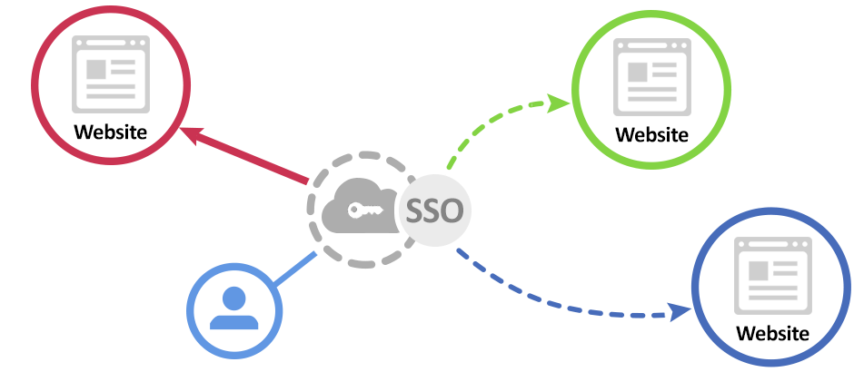
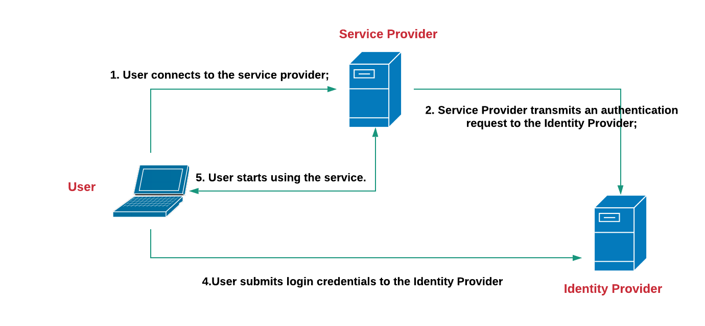
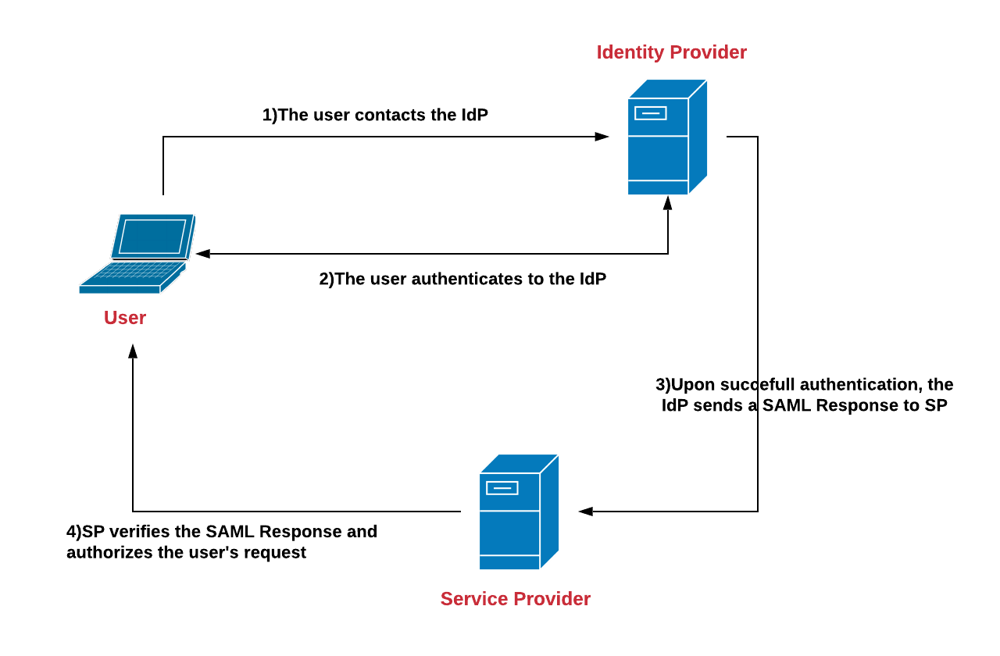
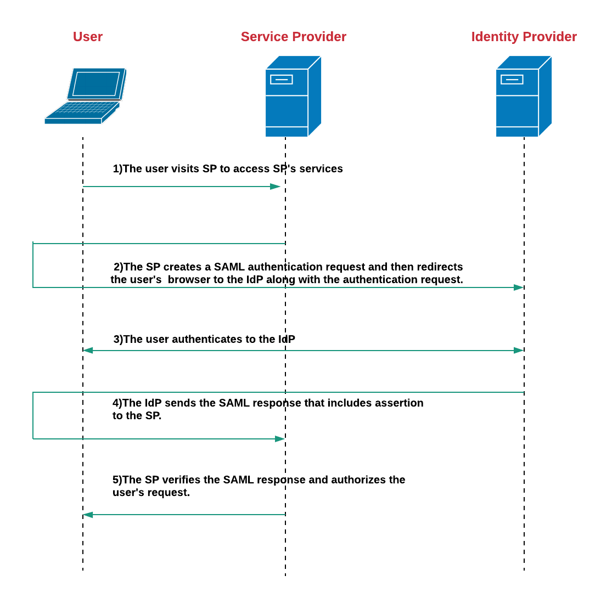

Normal bir kullanıcının, kullanıdığı her ortam için bir kullanıcı adı ve bir parola belirlemesi gerekiyor. Bunun yanı sıra belirlediği bu parolaları unutmadan hatırlaması gerekiyor. Normal bir kullanıcının günlük hayatında ortalama 5 ila 20 arasında bir oturum açma eylemi gerçekleştirdiği tahmin ediliyor. Birçok insan için beşten fazla kullanıcı adı ve parola bilgisini hatırlamak gerçekten zor oluyor. Tabi bunun zor olduğunu düşünen kullanıcılar her yerde aynı kullanıcı adı ve parola bilgisini kullanıyorlar. Bunun ise biz güvenlik uzmanları için güzel bir tarafı var. Bir kullanıcının, kullanıcı adı ve parolasını ele geçirdiğimizde birden fazla uygulamayı ele geçirme şansımız oluyor. 

Bu yüzden günümüzde kurumsal firmalarda SSO (Single Sing On) oldukça popüler bir hale geldi.

Single Sing On, bir kullanıcı adı / parola verisi ile uygulamalar ve sistemlere erişmesine imkan tanır. SSO ile kullanıcılar kendilerini daha güvende hissediyorlar. Kullanıcılar için gerekli olan bilgilerin sayısını azalttığından ve bu haliyle erişmek istedikleri tüm hizmetlere ve uygulamalara hızlıca erişebildikleriden ötürü daha iyi bir kullanıcı deneyimi sağlar.

Örneğin, Gmail’e giriş yaptıktan sonra, Google’a ait Drive, YouTube, Google+, Haritalar, Blogger, Play ve diğerleri gibi uygulamalardaki hesaplarınıza otomatik olarak erişim yetkisi verilir ve tüm bu servisleri kolayca kullanabilirsiniz.

## SSO Nasıl Çalışır?

SSO'nun farklı uygulanabilirlikleri olmasına rağmen, genel olarak akışı aynı devam ediyor diyebiliriz. SSO'nun genel akışını açıklamadan önce SSO'daki ana elemanları tanımlayalım.

**Service provider(SP)** -  Kullanıcılara servis sağlar ve kullanıcıya yetki vermek için kimlik sağlayıcıdan kimlik doğrulamasını alır.

**Identity provider(IdP)** - Kimlik sağlayıcı, servis sağlayıcıya erişmeye çalışan kullanıcının kimliğini sağlayan ve kullanıcının hizmete erişim haklarıyla birlikte kimlik doğrulama verileri gönderir.

**User** - Servisi kullanmak isteyen kişidir.

Kullanıcı, yukarıdaki akışta görüldüğü gibi kimlik doğrulama aşamasında birkaç kullanıcı bilgisi ve erişim hak kontrolü gibi adımlardan sonra servis sağlayıcıya yönlendirilir. Kullanıcı doğrulama, kimlik sağlayıcı tarafından yapılır ve kullanıcının tüm giriş bilgileri Kimlik Sağlayıcı'da saklanır.

SSO'ya kısaca bir giriş yaptık. SAML web SSO sürecini kavramak için yeterli olacaktır. Merak edip SSO'yu detaylı olarak incelemek isterseniz bu [linkten](https://medium.com/@vivekc.16/single-sign-on-sso-one-credential-for-all-d87c7a4484f6) inceleyebilirsiniz.

SSO için açık standart protokoller, servis sağlayıcıların ve kimlik sağlayıcıların kimlik bilgilerini nasıl aldıklarını belirtir. SAML, OpenID Connect ve WS Federation, SSO için açık ortak standartlardır.

SAML web SSO'yu incelemeden önce SAML ile detaylı olarak tanışırsak daha sağlıklı bir yol izlemiş oluruz.

## SAML'a Giriş

“SAML, taraflar arasında, özellikle bir kimlik sağlayıcı ile bir servis sağlayıcı arasında kimlik doğrulama ve yetkilendirme verilerinin değiş tokuş yapılması için kullanılan açık bir standarttır.”

Wikipedia tarafından yapılan tanım da yukarıdaki açıklamamız ile benzeşmektedir. 

SAML, kimlik sağlayıcılarının yetkilendirme bilgilerini servis sağlayıcılara aktarmasına izin verir. Bunun anlamı, birçok farklı web sitesine giriş yapmak için bir dizi kimlik bilgisi kullanabileceğinizdir. SAML , kimlik sağlayıcı ile servis sağlayıcılar arasında standartlaştırılmış iletişim için XML kullanır.

SAML, kullanıcıların bir kez oturum açabileceği anlamına gelen SSO özelliğini etkinleştirir ve aynı kimlik bilgileri diğer hizmet sağlayıcılara giriş yapmak için yeniden kullanılabilir. Web SSO, SAML'deki en popüler kullanım durumudur.

## SAML Beyanı Nedir?

SAML Beyanı, kimlik doğrulama hizmet sağlayıcılarının, kullanıcının yetkilendirme ayrıntılarını içeren ve servis sağlayıcılarına gönderdiği XML belgesidir. SAML Web SSO oturumu sırasında kullanıcının kimliğini doğrulamasından hemen sonra kimlik doğrulama ifadesi içeren onaylama geliştirildi. Üç farklı SAML Bildirimi türü vardır. Bunlar kimlik doğrulama, nitelik ve yetkilendirme kararıdır. 

- Kimlik doğrulama iddiası, kullanıcının kimliğini ve kullanıcının oturum açtığı zamanı ve kullandıkları doğrulama tekniğini sağlar.
- Atıf belirtisi, SAML niteliklerini servis sağlayıcısına iletir. SAML özellikleri, kullanıcı hakkında bilgi sağlayan belirli veri parçalarıdır.
- Yetkilendirme kararı, kullanıcının hizmeti kullanma yetkisine sahip olup olmadığını veya kimlik sağlayıcısının parola hatası nedeniyle isteklerini reddettiğini belirtir.

## SAML Web SSO İşlemi

SAML Web SSO, servis sağlayıcılar veya kimlik sağlayıcılar tarafından başlatılabilir. Kimlik Sağlayıcı tarafından başlatılan bir Web SSO akışı, kimlik sağlayıcı tarafından başlatılırken Servis Sağlayıcıda başlayan bir akışa Servis sağlayıcı tarafından başlatılır. 

### Kimlik Sağlayıcı Tarafından Başlatılan SSO

Bir kullanıcı kimlik işlemleri yapmaya çalıştığında kimlik sağlayıcının SSO'sunda başlar. Kimlik sağlayıcı, kullanıcının erişebileceği servis sağlayıcıya bağantılarda kimlik doğrulaması için yardımcı olur. Kullanıcının kimliğini doğruladıktan sonra, kimlik sağlayıcı, kimlik onaylama işleminin de içerisinde yer aldığı bir SAML yanıtı gönderir. Kullanıcı bir servis sağlayıcıya bağlanmaya çalıştığında yaptığı istekle beraber bu beyan da onunla gelir. Servis sağlayıcılar gelen beyanı analiz ederler ve sonrasında beyanın erişmek istediği yere erişim izni verir (veya reddeder).

### Servis Sağlayıcılar Trafından Başlatılan SSO

Servis sağlayıcı tarafından başlatılan SSO, Kimlik sağlayıcının tam tersi şeklinde işler. Bir kullanıcı ilk önce Servis sağlayıcıya gider ve Servis sağlayıcı onu Kimlik sağlayıcıya yönlendirir. Servis sağlayıcı tarafından başlatılan SSO çok daha yaygın olduğundan, bu akışı daha detaylı inceleyeceğiz.

Kimlik sağlayıcı, kullanıcının oturum açmak aşması için, kimlik doğrulama onayından oluşan 4 aşamalı bir SAML yanıtı oluşturur. Beyan dijital olarak imzalanır ve kullanıcının tarayıcısına gönderilir.

Bir sonraki adım, kullanıcının tarayıcısına ulaşır, dijital imzayı doğrular, beyanın içeriğini işler ve (tüm koşullar yerine getirilirse) kullanıcının güvenli bağlantısının "yerel" bir sürümünü oluşturur, dijital olarak imzalanmış olan belgeyi Servis sağlayıcı'ya iletir. Bu adımlar tamamlandığında, kullanıcı Servis sağlayıcıda "Oturum Açtı" olarak kabul edilir ve Servis Sağlayıcının hizmetlerine erişebilir. 

### Kaynaklar

* WSO2 documentations
* https://en.wikipedia.org/wiki/Security_Assertion_Markup_Language
