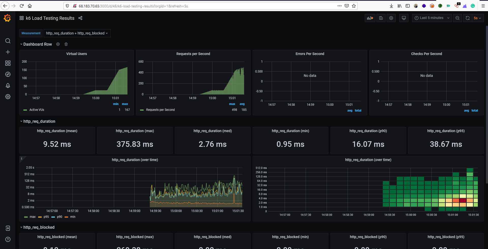
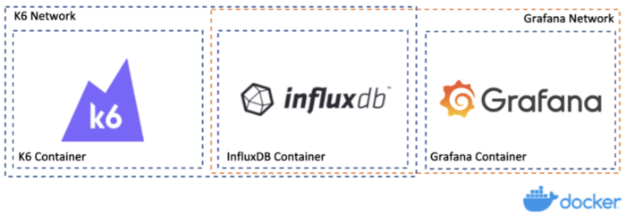
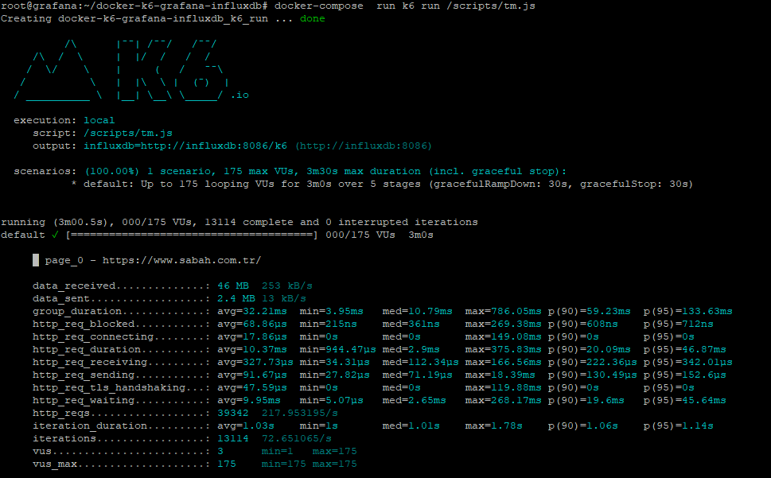
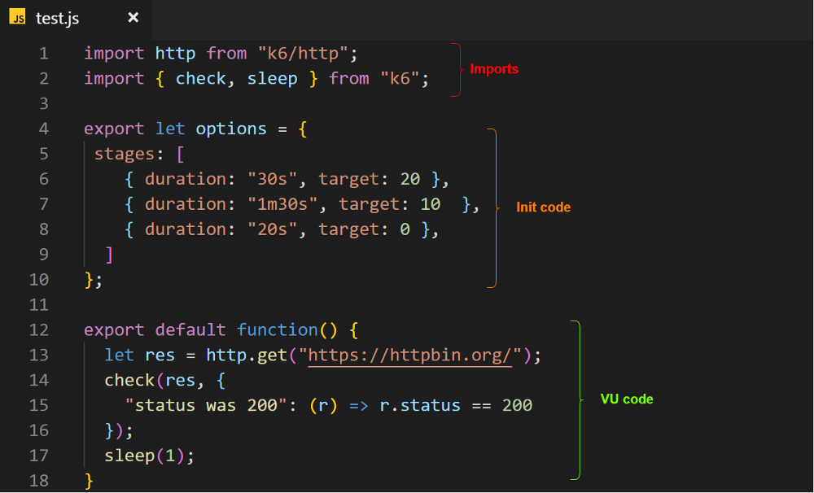

Yakın çevremde beni tanıyanlar Docker'a aşırı bağımlı olduğumu bilirler. Her şey Docker ve Konteyner'lar ile yapılabilir gibi davranırım ve elimden geldiğince yapmaya çalışırım. Yakın bir zamanda Yük Testi nasıl yapabiliriz. Nasıl bir ortama ve gereksinimlere ihtiyacımı olabilir şeklinde isterler ve sorular ile karşılaştım. Bu yazıda karşılaştığım ve yapmaya çalıştığım yük testi süreci hakkında bilgiler ve adımlar yer vermeye çalışacağım.

## Yük Testi Nedir?

Yük Testi, bir sistemin normal kullanım dışında aşırı kullanıma geçilmesi aşamasında sistemi verdiği tepkileri ölçmek amacıyla uygulanan bir test sürecidir. Bu yazı içerisinde yük testi uygulanacak olan sistem bir web uygulaması/web sayfası olacak. Yük Testi yaparak normalde web uygulamamıza giren kullanıcı sayısı 40 50 civarlarındaken sisteme 1000 2000 kişi giriş yapması aşamasında sistem nasıl tepkiler vermekte bunları ölçeceğiz.

Kullanacağımız ve kuracağımız mimaride Docker Compose + K6 + InfluxDB ve Grafana olacak. Bu uygulamalar ile sağlıklı bir yük testi süreci oluşturmaya ve yürütmeye çalışacağız.

### Docker ve Docker Compose Nedir?

Docker, ülkemizde yeni yeni duyulsada uzun zamandır dünya üzerinden kullanılan bir konteyner sağlayıcısıdır. 

Docker Compose,  Docker ile genel olarak kullanırken tek konteyner çalıştırmamız dışında kullandığımız araçtır. Docker Compose ile karmaşık ve bağımlıklıkları olan uygulamaları birbirileri ile haberleşecek bir yapıda kolaycak oluşturmamızı sağlar. Docker Compose ile yapılan işlemler Docker ile yapılamaz değil yapılabilir fakat Docker compose ile yapılan işlemleri Docker'da yapmamız biraz daha zaman alacaktır diyebiliriz. (Zaman alacak kısım, terminale aynı tanımların docker komutu olarak yazılması diyebiliriz.)

### InfluxDB Nedir?

InfluxDB açık kaynak kodlu go dili ile geliştirilmiş bir veritabanıdır. Gerçek zamanlı verilerin analiz edilmesinde ve sorgularda yüksek performan sağlayarak ön plana çıkmaktadır. 

### Grafana Nedir? 

Grafana, elinidez olan ve görselleştirmek istediğiniz tüm verileri tablolar ve grafikler halinde görüntülemenizi sağlayan açık kaynak kodlu bir yazılımdır.

### K6 Nedir?

K6, açık kaynak kodlu olup yük testi yapabilmemize imkan tanımaktadır.

-----

Yukarıdaki sözüne ettiğimiz uygulamaları kullanarak yük testi nasıl yaparız. Şimdi bunu görelim.

Bir yük testinin iyi bir şekilde görselleştirilmesi görselleştirme amacıyla gereken bir şey değildir diyebiliriz asıl önemli yanı test sırasında oluşan sorunları gerçekten anlamanın tek yolu denilebilir.

K6 ve Grafana kullanarak aşağıdaki şekilde yük testi yapabilirsiniz.

```
git clone git@github.com:xShuden/k6-load-test.git
cd k6-load-test

docker-compose up -d influxdb grafana

docker-compose run k6 run /scripts/ewoks.js
OR
docker-compose run k6 run /scripts/load-test-file.js
```
Grafana ve InfluxDB'yi çalıştırdıktan sonra grafana üzerinden veri takibi yapabilmemiz için k6 imajını konteyner olarak oluşturup çalıştırdığımızda metrikleri kolayca görebiliriz.

Grafana üzerinden verile görebilmek için http://IP:3000/d/k6/k6-load-testing-results şekliden tarayıcıdan istek yaptığınızda görebilirsiniz.



## Yük Testi Mimarisi



K6; Locust, Jmeter, Bechmark gibi yük testi yapabilmek için kullanılan araçlardan biridir. Yapınıza göre bu vb. araçlardan birini kullanarak yük testi gerçekleştirebilirsiniz. K6, GO Lang ile geliştirilmiş açık kayank kodlu bir projedir ve eş zamanlı olarak onlarca bağlantıya yüksek oranda yükler üretbildiğinden ötürü tercih ettim. Bazılarınız Locust vs. tercih edebilirler. Bu yazıda K6 ile ilerleyeceğiz.

Yapılacak yük testini görselleştirebilmemiz ve analiz edebilmemiz için yük testi öncesinde InfluxDB ve Grafana'nın aktif olması gerekmektedir. 

InfluxDB ve Grafana'yı aşağıdaki şekilde çalıştırabilirsiniz.

`docker-compose up -d influxdb grafana`

Yük testini başlatmak için ise aşağıdaki komutu çalıştırabilirsiniz.

`docker-compose run k6 run /scripts/ewoks.js`

Github üzerinden indirilen dosyalarin içerisinde "scripts" klasöründe yük testini gerçekleştirmek için kullanacağımız scriptlerimiz yer alıyor. K6 içerisinde kullanacağımız tüm scriptleri "scripts" dizinine koyarak kullanabiliriz. Aşağıda bir örneğini görebilirsiniz.

`docker-compose  run k6 run /scripts/tm.js`



## K6 Script Yapısı



- **Imports:** Burası, K6 API'ının ve kullanılmak istenilen diğer scriptlerin kullanılmak istenildiğini belirttiğimiz alandır.

- **Init Code:** Bu alanda, tüm testin nasıl olacağına dair bilgilerin yer aldığı alan denilebilir. Testin nasıl çalışacağı, bulutta nasıl dağıtılacağı gibi bilgilerin ve komutların belirtildiği yerdir. Açıkcası testin başlatılabilmesi için bu alanın ve alan içerisinde test bilgilerinin tanımlanması gerekmektedir.

- **VU Code:** K6 içerisinde sanal kullanıcı (VU) adı ile bilinen bir özellik bulunmaktadır. Init Code alanında tanımlanan eylemler burada tanımlanan kullanıcılar tarafından çalıştırılır ve bu eylemler K6 tarafından raporlanır. Test senaryosu burada tanımlanır.


### Kaynaklar

* https://k6.io/docs/
* https://k6.io/docs/results-visualization/influxdb-+-grafana#using-our-docker-compose-setup
* https://medium.com/swlh/beautiful-load-testing-with-k6-and-docker-compose-4454edb3a2e3
* https://devqa.io/k6-load-testing/
* https://blog.avenuecode.com/how-to-use-k6-load/performance-testing-for-web-pages
* https://www.geeksforgeeks.org/performance-testing-with-k6/
* https://project-awesome.org/k6io/awesome-k6